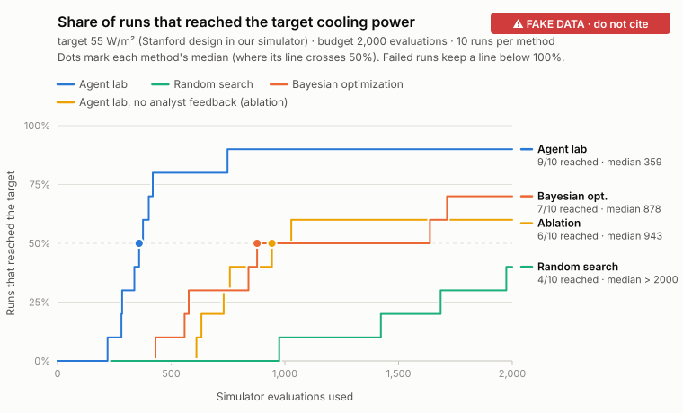

# Measured improvement

> **FAKE DATA, for development only. Do not cite any number on this page.**

On the same simulator, search space and budget (2000 evaluations per run, 10 runs per method), the median number of evaluations needed to reach the target net cooling power of 55 W/m² (the Stanford design in our simulator) was: the agent lab 359 (9/10 runs reached it); random search > 2000 (4/10 runs reached it); Bayesian optimization 878 (7/10 runs reached it); the ablation without analyst feedback 943 (6/10 runs reached it). The agent lab needed about 5.6× fewer evaluations than random search (95% CI 4.0×–7.0×); we claim at least 4.0×. Random search reached the target in fewer than half of its runs, so its median is capped at the budget of 2000 and the true speed-up is larger. The agent lab needed about 2.4× fewer evaluations than Bayesian optimization (95% CI 1.4×–6.0×); we claim at least 1.4×. The agent lab needed about 2.6× fewer evaluations than the ablation without analyst feedback (95% CI 1.8×–7.0×); we claim at least 1.8×. Failed runs are included in every number.

Reproduce: `python -m analysis.speedup analysis/fixtures/fake_benchmark.json` (input sha256 `fcc492fbbc37`).

## Per method

| Method | Runs that reached the target | Median evaluations to target | Best P_net, median / max (W/m²) |
|---|---|---|---|
| Agent lab | 9/10 (90%, 95% CI 60%–98%) | 359 | 56.2 / 57.6 |
| Random search | 4/10 (40%, 95% CI 17%–69%) | > 2000 (censored) | 54.5 / 57.9 |
| Bayesian optimization | 7/10 (70%, 95% CI 40%–89%) | 878 | 55.7 / 58.0 |
| Agent lab, no analyst feedback (ablation) | 6/10 (60%, 95% CI 31%–83%) | 943 | 55.4 / 56.6 |

## Speed-up

| Comparison | Point estimate | 95% CI | We claim |
|---|---|---|---|
| Agent lab vs random search | 5.6× | 4.0×–7.0× | at least 4.0× (baseline capped at budget) |
| Agent lab vs Bayesian optimization | 2.4× | 1.4×–6.0× | at least 1.4× |
| Agent lab vs the ablation without analyst feedback | 2.6× | 1.8×–7.0× | at least 1.8× |

## Definitions

- **median_evals**: evaluations by which half of the runs had reached the target (ceil(n/2)-th smallest; failed runs count as not reached)
- **speedup**: median(baseline) / median(focus); censored baseline median replaced by the budget (understates the speed-up)
- **ci95**: percentile bootstrap, 10000 resamples, seed 12345, runs resampled within each method
- With few runs per method the bootstrap interval is coarse; more seeds narrow it.
