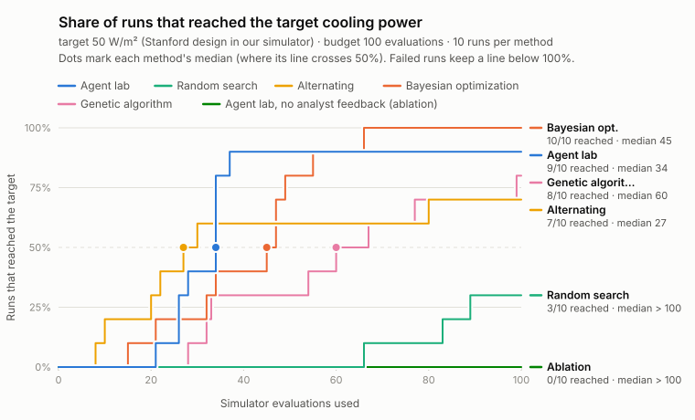

# Measured improvement

On the same simulator, search space and budget (100 evaluations per run, 10 runs per method), the median number of evaluations needed to reach the target net cooling power of 50 W/m² (the Stanford design in our simulator) was: the agent lab 34 (9/10 runs reached it); random search > 100 (3/10 runs reached it); Alternating 27 (7/10 runs reached it); Bayesian optimization 45 (10/10 runs reached it); Genetic algorithm 60 (8/10 runs reached it); the ablation without analyst feedback > 100 (0/10 runs reached it). The agent lab needed about 2.9× fewer evaluations than random search (95% CI 2.6×–3.8×); we claim at least 2.6×. Random search reached the target in fewer than half of its runs, so its median is capped at the budget of 100 and the true speed-up is larger. No speed-up: the agent lab needed 1.3× as many evaluations as Alternating (median). The agent lab needed 1.3× fewer evaluations than Bayesian optimization in the point estimate, but the 95% CI (0.8×–1.8×) includes no speed-up, so no speed-up is claimed. The agent lab needed 1.8× fewer evaluations than Genetic algorithm in the point estimate, but the 95% CI (1.0×–3.0×) includes no speed-up, so no speed-up is claimed. The agent lab needed about 2.9× fewer evaluations than the ablation without analyst feedback (95% CI 2.9×–3.8×); we claim at least 2.9×. The ablation without analyst feedback reached the target in fewer than half of its runs, so its median is capped at the budget of 100 and the true speed-up is larger. Failed runs are included in every number.

Reproduce: `python -m analysis.speedup results/benchmark.json` (input sha256 `cd5989e042dd`).

## Per method

| Method | Runs that reached the target | Median evaluations to target | Best P_net, median / max (W/m²) |
|---|---|---|---|
| Agent lab | 9/10 (90%, 95% CI 60%–98%) | 34 | 55.3 / 57.9 |
| Random search | 3/10 (30%, 95% CI 11%–60%) | > 100 (censored) | 47.0 / 54.0 |
| Alternating | 7/10 (70%, 95% CI 40%–89%) | 27 | 50.5 / 57.0 |
| Bayesian optimization | 10/10 (100%, 95% CI 72%–100%) | 45 | 51.5 / 55.0 |
| Genetic algorithm | 8/10 (80%, 95% CI 49%–94%) | 60 | 50.8 / 54.2 |
| Agent lab, no analyst feedback (ablation) | 0/10 (0%, 95% CI 0%–28%) | > 100 (censored) | 31.1 / 34.8 |

## Speed-up

| Comparison | Point estimate | 95% CI | We claim |
|---|---|---|---|
| Agent lab vs random search | 2.9× | 2.6×–3.8× | at least 2.6× (baseline capped at budget) |
| Agent lab vs Alternating | 0.8× | 0.4×–3.1× | no speed-up |
| Agent lab vs Bayesian optimization | 1.3× | 0.8×–1.8× | no speed-up |
| Agent lab vs Genetic algorithm | 1.8× | 1.0×–3.0× | no speed-up |
| Agent lab vs the ablation without analyst feedback | 2.9× | 2.9×–3.8× | at least 2.9× (baseline capped at budget) |

## Definitions

- **median_evals**: evaluations by which half of the runs had reached the target (ceil(n/2)-th smallest; failed runs count as not reached)
- **speedup**: median(baseline) / median(focus); censored baseline median replaced by the budget (understates the speed-up)
- **ci95**: percentile bootstrap, 10000 resamples, seed 12345, runs resampled within each method
- With few runs per method the bootstrap interval is coarse; more seeds narrow it.
